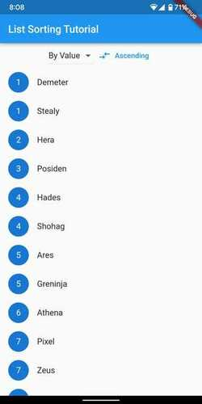
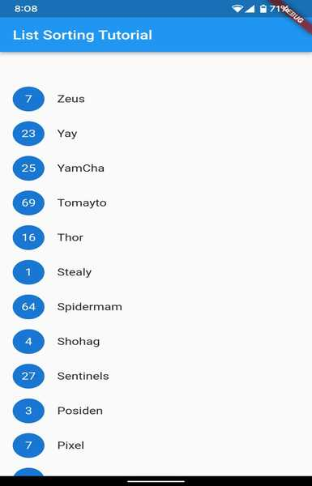
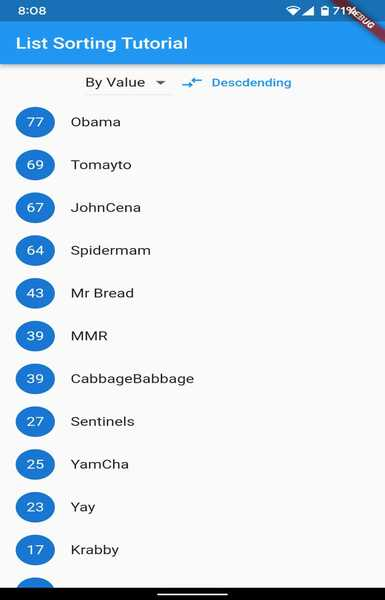
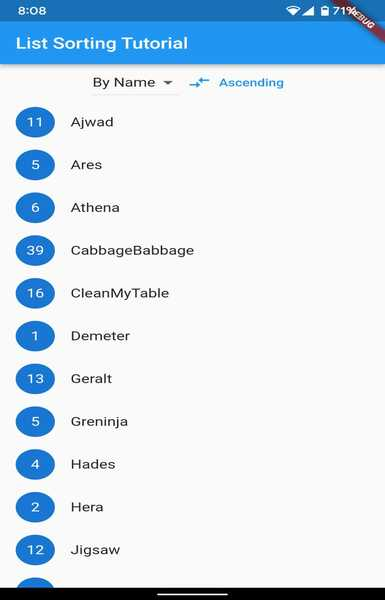

# Sorting a List View
ListView is the most commonly used scrolling widget. It displays its children one after another in the scroll direction. In the cross axis, the children are required to fill the ListView. In this tutorial we will show how to sort a ListView based two fields in both and ascending and descending orders




## Prerequisites
1. Basics of stateful and stateless widget
2. List Data Structures 
3. ListView Widget
4. DropDown Widget

## Project Setup
For this project you can create a new project or a new file in your existing project.No other dependencies are required.


### **Step 1: Create Flutter Project and Add a Simple Stateful Widget**

We create a simple stateful widget. We return a scaffold that contains an appbar and a text in the center

```dart
class MyApp extends StatefulWidget {
  const MyApp({super.key});
  @override
  State<MyApp> createState() => _MyAppState();
}

class _MyAppState extends State<MyApp> {
  @override
  Widget build(BuildContext context) {
    return MaterialApp(
      title: 'CSEDU',
      home: Scaffold(
          appBar: AppBar(
            title: const Text('List Sorting Tutorial'),
          ),
          body: const Center(
            child: Text('Hello# '),
          )),
    );
  }
}
```

### **Step 2: Creating a Pair and List Data Structure**

We will use a simple list of pairs/tuples for our list view
so we create a very simple Pair class with an integer and a string value


```dart
//Pair Class
class Pair {
  int value;
  String name;
  Pair(this.value, this.name);
}
```
Now, make a List of pairs and insert some values to it.
```dart
//Insert items to the list
class _MyAppState extends State<MyApp> {
  List<Pair> myList = [
    Pair(3, 'Posiden'),
    Pair(4, 'Hades'),
    Pair(7, 'Zeus'),
    Pair(2, 'Hera'),
    Pair(1, 'Demeter'),
    Pair(6, 'Athena'),
    Pair(5, 'Ares'),
  ];

  /*

    code 

  */

}
```

### **Step 3: Creating a List View Widget**

Now we will add a function which will return a listView widget named listviewBuilder(). In the listView widget there is variable called currentItem and itemCounter. We assign our list length to itemCounter and our list to curretnt item We take every item from the list and view it as listTile. We add a circle avater to view the value and text field to view the name of the item. 



``` dart
//listView builder function
class _MyAppState extends State<MyApp> {
  /*

  code

  */

  Widget listviewBuilder() => ListView.builder(
        itemCount: myList.length,
        itemBuilder: ((context, index) {
          final currentItem = myList[index];
          return ListTile(
            leading: CircleAvatar(
              radius: 20,
              child: Text(currentItem.value.toString()),
            ),
            title: Text(currentItem.name),
          );
        }),
      );
}
``` 
### **Step 4: Adding Sort Buttons and Drop Down Menu**

Here, we add a toggle button to select between ascending and descending order of sort. We aslo add a drop down menu to select on which field our list will be sorted (value/name)


```dart
//Required variables
//true : ascending, false: descending
class _MyAppState extends State<MyApp> {

  /*

  code

  */

  bool order = true;
  List<String> dropDown = [
    'By Value',
    'By Name',
  ];
  String curDropdownValue = 'By Value';

  @override
  Widget build(BuildContext context) {
    return MaterialApp(
          /*

          code
          
          
          */
          body: Center(
            child: Column(
              children: [

                //row for Button and DropDown 
                Row(mainAxisAlignment: MainAxisAlignment.center, children: [
                  //Button For Changing sorting order
                  TextButton.icon(
                    icon: const Icon(Icons.compare_arrows_outlined),
                    label: Text(order ? 'Ascending' : 'Descdending'),
                    onPressed: () {
                      setState(() {
                        order = !order;
                      });
                    },
                  ),
                  //Drop Down menu for selecting which value to sort by
                  DropdownButton<String>(
                    value: curDropdownValue,
                    items:
                        dropDown.map<DropdownMenuItem<String>>((String value) {
                      return DropdownMenuItem<String>(
                        value: value,
                        child: Text(value),
                      );
                    }).toList(),
                    onChanged: (String? value) {
                      setState(() {
                        curDropdownValue = value!;
                      });
                    },
                  ),
                ]),

                //Calling the listviewBuilder function
                Expanded(child: listviewBuilder()),
              ],
            ),
          )),
    );
  }

  /*
  code

  */
}
```

### **Step 5 : Adding Sort Functions to listViewbuilder function**

Here, we use the built-in sort method of List data structure on listViewbuilder() function. Based on the field of the drop-down menu and state of the button we determine in which order the list should be sorted and on what field. We do this by passing b.value or b.name in the compareTo() method. By default the sort method sorts the list in ascending order. We reversed the list if the state of the button is descending.

```dart
Widget listviewBuilder() => ListView.builder(
        itemCount: myList.length,
        itemBuilder: ((context, index) {
          //Newly added code
          List<Pair> sortedList = myList;
          if (curDropdownValue == 'By Value') {
            sortedList.sort((a, b) => a.value.compareTo(b.value));
            if (!order) sortedList = List.from(sortedList.reversed);
          } else {
            sortedList.sort((a, b) => a.name.compareTo(b.name));
            if (!order) sortedList = List.from(sortedList.reversed);
          }
          //Newly added code

          //take currentItem from sortedList
          final currentItem = sortedList[index];
          return ListTile(
            leading: CircleAvatar(
              radius: 20,
              child: Text(currentItem.value.toString()),
            ),
            title: Text(currentItem.name),
          );
        }),
      );

```
## Screenshots


Sorting by value in ascending order



Sorting by value in descending order




Sorting by name in ascending order


Sorting by name in descending order


## Rescources 
1. [Stateful Widget](https://api.flutter.dev/flutter/widgets/StatefulWidget-class.html)
2. [List Class dart](https://api.dart.dev/be/180791/dart-core/List-class.html)
3. [Pair Class dart](https://pub.dev/documentation/analyzer_plugin/latest/utilities_pair/Pair-class.html)
4. [List View Widget](https://api.flutter.dev/flutter/widgets/ListView-class.html#:~:text=ListView%20is%20the%20most%20commonly,extent%20in%20the%20scroll%20direction.)
5. [A good video tutorial on this topic](https://www.youtube.com/watch?v=CzOEx5ZYOYI)
   
## Errors and Cautions

1. Make sure to use stateful widget
2. Add correct item counts in the listViewbuilder functions
3. Make sure to use setState whenever you are making changes to any variables inside a stateful widget

## Github Repository
[sort_list_tutorial_flutter](https://github.com/arfbllh/sort_list_tutorial_flutter)

## Demo APK for this tutorial

[Apk file](https://github.com/arfbllh/sort_list_tutorial_flutter/blob/master/sort_list%201.0.0_1.apk)